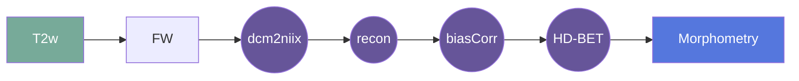

# ANTs VBM
This gear performs Voxel Based Morophometry using Jacobian determinants with ANTs on infants between 0-2 years old with isotropic reconstructed Hyperfine scans.

## Overview

[Usage](#usage)
Should be automated if setup correctly. Requires age to select appropriate template for registration. The configuration allows a selection of atlases to choose from. ROI volume estimation will be performed on these.
[FAQ](#faq)

### Summary
Takes the isotropic hyperfine reconstructions that have been bias corrected (N4) and calculates volume estimates for white matter, grey matter & CSF by calculating Jacobian determinants. 
- Requires matching to template used in recon
- Required brain mask from HD-BET (Could include conditional to run HD-BET if files not found)

### Cite

**license:**
MIT License  

**url:** <https://github.com/Nialljb/fw-ants-vbm>

**cite:**  
Sean C.L. Deoni, Muriel M.K. Bruchhage, Jennifer Beauchemin, Alexandra Volpe, Viren D'Sa, Matthew Huentelman, Steven C.R. Williams,
Accessible pediatric neuroimaging using a low field strength MRI scanner, NeuroImage, Volume 238, 2021, 118273, ISSN 1053-8119,
https://doi.org/10.1016/j.neuroimage.2021.118273.  
(https://www.sciencedirect.com/science/article/pii/S1053811921005498)  

Bourke, N. J., Demarchi, C., De Simoni, S., Samra, R., Patel, M. C., Kuczynski, A., Mok, Q., Wimalasundera, N., Vargha-Khadem, F., & Sharp, D. J. (2022). Brain volume abnormalities and clinical outcomes following paediatric traumatic brain injury. Brain, 145(8), 2920\u20132934. https://doi.org/10.1093/brain/awac130  

### Classification

*Category:* analysis

*Gear Level:*

* [ ] Project
* [ ] Subject
* [ ] Session
* [ ] Acquisition
* [x] Analysis

----

### Inputs

* api-key
  * **Name**: api-key
  * **Type**: object
  * **Optional**: true
  * **Classification**: api-key
  * **Description**: Flywheel API key.

### Config

* input
  * **Base**: file
  * **Description**: input file (isotropic reconstruction, bias corrected & skull stripped)
  * **Optional**: false

### Outputs
* output
  * **Base**: file
  * **Description**: segmentated file 
  * **Optional**: false

* volume
  * **Base**: file
  * **Description**: volume estimation file (csv)
  * **Optional**: true

#### Metadata

No metadata currently created by this gear

### Pre-requisites

- Three dimensional structural image, bias corrected and skull stripped

#### Prerequisite Gear Runs

1. ***dcm2niix***
    * Level: Any
2. ***file-metadata-importer***
    * Level: Any
3. ***file-classifier***
    * Level: Any

#### Prerequisite

## Usage

This section provides a more detailed description of the gear, including not just WHAT
it does, but HOW it works in flywheel

### Description

This gear is run at either the `Subject` or the `Session` level. It downloads the data from the output of a previously run `HD-BET` analysis for that subject/session into the `/flwyhweel/v0/work/` folder and then runs the
`hyperfine-vbm` pipeline on it.

After the pipeline is run, the output folder is zipped and saved into the analysis
container.

#### File Specifications

This section contains specifications on any input files that the gear may need

### Workflow

A picture and description of the workflow

Description of workflow

1. Upload data to container
2. Prepare data by running the following gears:
   1. file metadata importer
   2. file classifier
   3. dcm2niix
3. Run the ciso gear (Hyperfine triplane aquisitions)
4. Run N4 bias correction gear
5. Run HD-BET
6. Run VBM

### Use Cases

## FAQ

[FAQ.md](FAQ.md)

## Contributing

[For more information about how to get started contributing to that gear,
checkout [CONTRIBUTING.md](CONTRIBUTING.md).]
